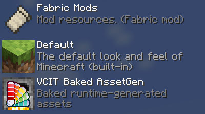
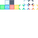

# Asset Generation
Vanilla minecraft allows changing an item's model through components (`item_model`, `equippable`), but doing so requires more than custom texture, you also need to provide new JSON files of various kinds. This remains true with Variants-CIT. Even when you get a module working by providing only textures, VCIT actually generates those JSON files automatically under the hood.

Older versions of Variants-CIT did this through the [`modelParent`](./Module-Configuration#field-modelparent) option. The newer [`assetGen`](./Module-Configuration#asset-generation) option is a more powerful alternative to this.


This page describes how the generation process works, and hwow you may use it to automatically generate custom assets. For common use cases, some [presets](#built-in-asset-generator-presets) already exists.

### Index
- [Baking generated asset](#baking-generated-assets) (Mod incompatibility workaround)
- [Built-in generator presets](#built-in-asset-generator-presets)
- [Custom generators](#custom-asset-generators)
	- [Pipeline](#pipeline)
	- [Custom presets](#custom-presets)
	- [Templates](#templates)
	- [Schema](#custom-asset-generators)


## Baking generated assets
Variant-CIT's generates asset at runtime, during the resource-reload process. This is known to be incompatible with ModernFix's [Dynamic Resources](https://github.com/embeddedt/ModernFix/wiki/Dynamic-Resources-FAQ) feature.
A workaround for this is simply to turn those assets into a regular resource pack.

The command `/variants-cit assetgen createPack` will create and load a resource pack called **"VCIT Baked AssetGen"**, which includes all assets generated by all modules from all currently loaded packs.

> [!CAUTION]
>
> **This command will delete any already existing file in the pack's directory.**  
> (`.minecraft/resourcepacks/VCIT Baked AssetGen/`)

For players, this command may need to be manually re-run everytime new VCIT-dependent resource packs are loaded or unloaded.

Resource-pack makers can copy the thusly baked assets into their own pack, to ensure it works out of the box in every scenario. Be careful not to overwrite your own assets in the process; in case of conflicts, prefer your own assets over the baked ones.

Modpack makers can include the baked resource pack directly into their modpacks. The pack should be placed at the bottom of the stack, below even the vanilla resources:



# Built-In Asset Generator Presets
Presets are the easy out to change an item's texture by providing only textures. Just set your module's `assetGen` option to one of the values below.

```json
{
	"type": "...",
	"modelPrefix": "...",
	"assetGen": "item_model/generated"
}
```

### Preset: `item_model/generated`
Creates basic models and item states for a simple item with no animation. Most items will use this option.
This is equivalent to the old-school option `"modelParent":"item/generated"`.

### Preset: `item_model/handheld`
Creates basic models and item states for a simple tool with no animation.
This is equivalent to the old-school option `"modelParent":"item/handheld"`.

### Preset: `item_model/handheld_rod`
Creates basic models and item states for a rod-like item with no animation. (stick, blaze rods,..)
This is equivalent to the old-school option `"modelParent":"item/handheld_rod"`.

### Preset: `item_model/player_head`
Creates basic models and item states for head-like items. This is equivalent to the old-school option `"modelParent":"variants-cit:item/player_head"`.

The expected texture for this model is 64x64 pixels, and is formatted like a player skin:



### Preset: `item_model/bow`
Creates models and items states with the same structure as the vanilla bow.
This expects additional textures or baked models with the following suffixes:
- `_pulling_0`
- `_pulling_1`
- `_pulling_2`

### Preset: `item_model/crossbow`
Creates models and items states with the same structure as the vanilla crossbow.
This expects additional textures or baked models with the following suffixes:
- `_arrow`
- `_rocket`
- `_pulling_0`
- `_pulling_1`
- `_pulling_2`

### Preset: `item_model/fishing_rod`
Creates models and items states with the same structure as the vanilla fishing rod.
This expects additional textures or baked models with the following suffixes:
- `_cast`

### Preset: `item_model/goat_horn`
Creates models and items states similar to the vanilla goat horn.

No additional texture needs be provided for the tooting animation.
Custom tooting models can be provided with a `_tooting` suffix. Do note that this a **SUFFIX**, unlike the vanilla goat horn which uses `tooting_` as a *prefix*.

### Preset: `item_model/spear`
Creates models and items states similar to the vanilla spear.
This expects additional textures suffixed with:
- `_in_hand`.

**This preset is functional only on MC 1.21.11 and onward.**

### Preset: `item_model/shield_no_pattern`
Creates models and items states similar to the vanilla shield.
**Banner patterns are not supported at this time.**

No additional texture needs be provided for the blocking animation.
Custom blocking models can be provided with a `_blocking` suffix.

Generated models have the same shape as the vanilla shield, and expected a similarly formatted texture. **Unlike vanilla, textures must be located somehwere down `textures/item/`** (like for any other non-shield item preset).

### Preset: `item_model/trident`
Creates models and items states similar to the vanilla trident.

This expects additional textures suffixed with:
- `_in_hand`

or additional baked models suffixed with:
- `_in_hand`
- `_throwing`

The auto-generated `_throwing` model will use the `_in_hand` texture.

Generated models will have the same shape as the vanilla trident, and expect a similarly formatted texture.
**Unlike vanilla, the `_in_hand` texture must be located in the same folder as the GUI textures** (like for any other non-trident preset).

### Preset: `item_model/trident_gui_only`
Creates item models for a trident, but only replace the inventory texture. The in-hand model will use the vanilla model and texture.

### Preset: `equipment/humanoid`
Creates two-layers equipment models for humanoid armors.
This expects textures for the following layers:
- `humanoid/`
- `humanoid_leggings/`

### Preset: `equipment/elytra`
Creates single-layer equipment models for an elytra. The elytra will use the player's cape texture if any.
This expects textures for the following layers:
- `wings/`

### Preset: `equipment/saddle`
Creates equipment models for a saddle which supports all animals.
This expects textures for the following layers:
- `camel_saddle/`
- `donkey_saddle/`
- `horse_saddle/`
- `mule_saddle/`
- `pig_saddle/`
- `skeleton_horse_saddle/`
- `strider_saddle/`
- `zombie_horse_saddle/`

Providing all layers is not strictly required, however the generated json model still expects them all, and thus will show a missing texture if equipped to the wrong animal.

### Preset: `trim_pattern/humanoid`
Creates trim models for humanoid armors.
This expects textures for the following layers:
- `humanoid/`
- `humanoid_leggings/`

# Custom Asset Generators
## Pipeline
At the modules' level:
1. Assets are fed into every generator. As a rule of thumbs, generators only process and produce assets that their module can use.

2. All generator attempt to generate new assets from the given input. If multiple generators end up creating assets with the same name, the firstmost generator in the array takes priority.

3. If multiple modules attempt to generate the same assets, the module with the most specific `modelPrefix` will take priority. If the prefixes have the same size, it is undefined which module takes priority.

4. The generated assets are added to a virtual resource pack. This pack is located at the bottom of the stack, so generators can never overwrite already existing assets.
You can use the command `/variants-cit assetGen peek` to quickly check the content of any asset in this pack.


At the generators' level:
1. Each generator receives every single asset that corresponds to its `pass` option. The ID of each asset is tested against the generator's input regex. If it doesn't match, the generator ignores this asset. The ID used here is not necessarily the asset's full identifier. (See [`pass`](#field-pass))

2. The generator computes the ID of its output asset, or if specified, the ID of the output's [radical](#field-radicalpath). This ID is tested against the module. If the module refuses to collect it, the generator will not produce this output.
For an ID to be accepted, it must match the model prefix, the fallback model, or special models. For IDs that match the modelPrefix, certain module types may further restrict which ones they will accept. (E.g: number-based modules only accept number-based assets.)

3. The generators fills up a template using the ID of the input asset, output asset, and other user-defined variables. The filled template is used as the content of the generator's output.


## Templates
In short: Templates are just big substitution strings.

Templates are a type of resources used as the basis for every auto-generated assets. They can look like JSON assets of any other type, but have some data missing in them, which will be filled in by the asset generators.

Custom templates can be provided under `variants-cit/templates/`. For now only JSON files are gathered, but this may be extended to other file extensions in the future.
To serve as examples, you can find all built-in templates here:  
[assets/variants-cit/variants-cit/templates/](https://github.com/Estecka/mc-Variants-CIT/tree/HEAD/src/main/resources/assets/variants-cit/variants-cit/templates)

Variable `${names}` can contain any character in `[a-zA-Z0-9_]`, but can never start with a number. They must always be surrounded by curly braces.

Some variables are automatically generated by the mod, and are available to all templates. By convention, they use `SCREAMING_SNAKE_CASE`. Some built-in templates still contain variables in `camelCase`, which must be defined in the generators using those templates.

#### Auto-generated variables:
- **`${NAMESPACE}`** :  
  The namespace being worked with. All variables mentionned below use this namespace.

- **`${INPUT_PATH}`**, **`${INPUT_ID}`** :  
  The path and full identifier of the asset that triggered the generator.

- **`${OUTPUT_PATH}`**, **`${OUTPUT_ID}`** :  
  The path and full identifier of the asset being generated.

- **`${RADICAL_PATH}`**, **`${RADICAL_ID}`** :  
  The path and full identifier of the output's master asset. (See [Radical](#field-radicalpath))

## Custom Presets
Generator presets can be added in `variants-cit/assetgen_presets/`, and then referenced from multiple modules. Generators stored here won't do anything until they are referenced from at least one module.

**Creating a preset is not a requirement to use custom generators.** Generators can instead be defined directly inside the `assetGen` field of a module.

Unlike the `assetGen` field, presets must always be declared inside an array, and cannot contain references to other presets.


## Schema
The simplest possible generator only needs to define the asset types it works with, and the template to use :
```json
{
	"pass": "models_from_textures",
	"template": "models/item/generated"
}
```
Below is a more complete generator. This extract from the `item_model/trident` preset looks for `_in_hand` textures, and generate `_throwing` baked models who use that texture :
```json
{
	"pass": "models_from_textures",

	"inputPath": "(.*)_in_hand",
	"outputPath": "$1_throwing",
	"radicalPath": "$1",

	"template": "models/parent",
	"variables": {
		"modelParent": "variants-cit:item/trident_throwing"
	}
}
```

For more examples, you can find the other built-in presets here:
[assets/variants-cit/variants-cit/assetgen_presets/](https://github.com/Estecka/mc-Variants-CIT/tree/HEAD/src/main/resources/assets/variants-cit/variants-cit/assetgen_presets)

### Field: `pass`
**Mandatory**, String.

Indicates which asset type is accepted as input, and which asset type is produced.
This also affects which portion of the asset ID will be tested against the input regex, and how the output path will be interpreted:

Pass                           | Input Files                                 | Output Files                    | Core file
------------------------------ | ------------------------------------------- | ------------------------------- | -------
**`trims_from_textures`** | textures/trims/entity/`<inputPath>`.png | variants-cit/trim_pattern/`<outputPath>`.json   | variants-cit/trim_pattern/`<radicalPath>`.json
**`equipments_from_textures`** | textures/entity/equipment/`<inputPath>`.png | equipment/`<outputPath>`.json   | equipment/`<radicalPath>`.json
**`models_from_textures`**     | textures/item/`<inputPath>`.png             | models/item/`<outputPath>`.json | items/`<radicalPath>`.json
**`items_from_models`**        | models/item/`<inputPath>`.json              | items/`<outputPath>`.json       | items/`<radicalPath>`.json

Any model generated during the `models_from_texture` pass will then be received by the `items_from_models` pass.

**The input path for trim and equipment textures includes the layer name, wich you will want to exclude from the radical and output pathes.**

### Field: `inputPath`
**Optional** Regex, defaults to `"^.*$"` (accepts everything).

Describes what assets can trigger this generator.
This regex is matched against a portion of input asset's path (See [Pass](#field-pass)). If the input matches, the defined output is created.

Generally, a generator only generates assets that its module will accept to collect. I.e: assets matching the `modelPrefix`, the `fallback` model, and the `special` models. There is no need to write a regex that specifically excludes other assets. (See also: [Radical](#field-radicalpath))


### Field: `outputPath`
**Optional** Regex Substitution String, defaults to `"$0"` (same as input).

The path of the identifier of the asset that will be generated. This is a regex substitution string, which can use values captured by the input regex.
This only represent a portion of the output file's path. (See: [Pass](#field-pass))

### Field: `radicalPath`
**Optional** Regex Substitution String, defaults to the value of `outputPath`.

The path of the identifier of the core/master asset that controls the ouput asset. I.e, the item states or equipment model that control a texture or a baked model.
A generator's output will be discarded if its radical cannot be collected by the module.

This allows the generator to create "branching" assets whose IDs differ slightly from the root asset. This is particularly relevant to the `models_from_texture` pass, when generating assets with suffixes, such as `_pulling`, `_blocking`, etc.

Examples of scenarios where having a radical is important : 
- **You are generating assets for a special or a fallback model.**  
  With `"fallback":"xyz"`, the generator would normally refuse to create a model called `xyz_pulling`, unless the radical ties it back to `xyz`.
- **You are using a module type with a very strict syntax on model names.** (`enchantment_vector`, `component_threshold`, etc)  
  The `durability` module only accept models whose variant IDs are valid numbers. Its generator would normally refuse to create a variant model called `50_pulling`, even if it matches the model prefix, unless the radical ties it back to the `50` variant.

"Radical" here is to be understood as "linguistic root", because it is obtained by removing some suffix from the output path. The radical can be thought of as having the same role as a "variant ID", except it can also be used to designate fallback and special models.

### Field: `template`
**Mandatory**, namespaced identifier.

The identifier of the [template](#templates) used to generate an asset.

This identifier defaults to the `variants-cit` namespace, instead of `minecraft`. As such, built-in templates don't require the namespace to be specified.

### Field: `variables`
**Optional**, maps variable names to their values.

Hardcoded variables that will be used to fill the template. Any variable defined here will override auto-generated variables.
