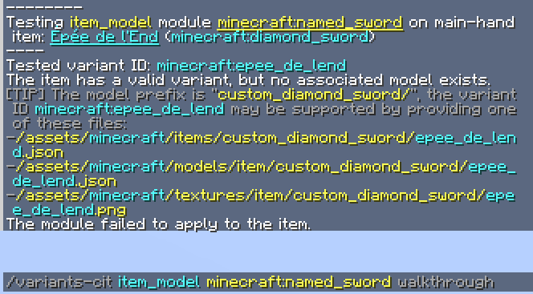

# Getting Started
## The basics
Variants-CIT's format is fundamentally different from Optifine. In order to get your bearings, this will walk you through the process of changing a diamond sword based on a name given in an anvil. This assumes you already have some basic understanding of [namespaced identifiers](https://minecraft.wiki/w/Identifier), and how to [create and organize resource packs](https://minecraft.wiki/w/Tutorial:Creating_a_resource_pack).

### 1. Create the CIT module

The module is the object that decides when to change the item's texture, and what texture to use.
A single module can manage multiple variants, and does not care about the exact list of variants. In almost all cases, **you'll only need a single module per item, regardless of how many textures you have.**

Create a JSON file anywhere in `assets/<namespace>/variants-cit/item/<path>.json`. The `<namespace>` and `<path>` of the file doesn't affect its functionality. Your name should nonetheless be unique, since other packs can overwrite each other's modules.

The file will have this content:
```json
{
	"type": "custom_name",
	"items": "minecraft:diamond_sword",
	"modelParent": "minecraft:item/handheld",
	"modelPrefix": "item/custom_diamond_sword/"
}
```

- `type` can be anything from [this list](Module-Types). Simply changing the module's type is enough to change its behaviour; the rest of the pack's structure will remain the same in almost all cases.


- `modelParent` will usually be `item/handheld` for tools and weapons, or `item/generated` for almost all other items.

- `modelPrefix` can be whatever your want, but keep note of what you choose; this is the folder where we'll put our textures later on.
The trailing slash '`/`' at the end of the prefix is important !

  Starting MC 1.21.4, the leading `item/` in the model prefix is implied, but if you want your pack to be compatible with MC 1.21.3 and earlier, you should always specify it.

See [here](Module-Configuration#field-modelprefix) for an advanced quide on how to configure modules.


### 2. Add textures to the pack

Suppose we want to use a custom texture for a sword named **"Épée de l'End"**.

We need to figure out the so-called **"variant ID"** of this item. The variant ID will be combined with the previously chosen model prefix, to give the ID of the model/texture that will be used for this item. Finding a variant id is a common step for all module types, but the way it is calculated varies from one type to another. In the case of `custom_name`, illegal are characters are simply removed from the item's name.

In general, you can get the correct variant ID by using the following command, while holding the sword in your main hand:
```
/variants-cit item_model <module id> walkthrough
```




In your pack, place your texture at:  
`/assets/minecraft/textures/item/custom_diamond_sword/epee_de_lend.png`  
and that's it! The mod will know to use this texture for this name, you texture pack is now functional.

If you want to support more custom names, you don't need to make any change to the module; just add more textures to the pack, and name them appropriately.

### 3. Using custom models

Up to this point, this will work if you just want a flat texture for your sword. If you want to use custom [json model](https://minecraft.wiki/w/Model) or [item states](https://minecraft.wiki/w/Items_model_definition), simply provide appropriately named files of those types:  
`/assets/minecraft/items/custom_diamond_sword/epee_de_lend.json`  
`/assets/minecraft/models/item/custom_diamond_sword/epee_de_lend.json`  


Ultimately, all the mod does is override the value of the `item_model` component of the item, meaning everything that can be done with those can be done with Variants-CIT. Having a good understanding of how this component works will help you a lot.

For certain items that have usage animations (bows, shields, etc), those animations won't work unless you provide the correct item-states. The mod currently cannot generate those states automatically.

Variant ID                         | `<namespace>:<path>`
---------------------------------- | :-------------------
Equivalent `item_model` component  | `<namespace>:<modelPrefix><path>`
Matching item state                | `/assets/<namespace>/items/<modelPrefix><path>.json`
Matching baked model               | `/assets/<namespace>/models/item/<modelPrefix><path>.json`
Matching texture                   | `/assets/<namespace>/textures/item/<modelPrefix><path>.png`

## Using custom data as variants
The `custom_name` module type we used above requires little configuration, but is designed around a specific use case. There are other [purpose-made modules](./Module-Types#purpose-made-modules) for other common use cases, but if you need a variant that is stored into an unusual location, the two modules types that will interest you are [`component_data`](./Module-Types#module-component_data) and [`component_format`](./Module-Types#module-component_format); those let you pick data from anywhere in a chosen component's NBT representation.

Relevant documentation: [Item Properties / Transforms](./Item-Properties)

### Locating the data
Suppose you want to create a module for the effect of suspicious stew:
First, you need to figure out where the variant is stored in the item. Go in-game, put a bowl of supicious stew in your main hand, and use this command:  
```
/data get entity @s SelectedItem.components
```

 This should print something like this into the chat:

![{"minecraft:suspicious_stew_effects": [{duration:7, id:"minecraft:saturation"}]}](./nbt_path_command.jpg)

Here we learn that: (1) The effect id is in a component called `suspicious_stew_effect`. (2) The effect is stored under a key "id", which itself is stored at the first position of an array.

Fill this into the `componentType` and ['`nbtPath`'](./Item-Properties#field-nbtpath) parameters of component_data, and your module will use the effect id as the variant id:
```json
{
	"type": "component_data",
	"items": "minecraft:suspicious_stew",
	"modelPrefix": "item/stew/",
	"parameters": {
		"componentType": "suspicious_stew_effects",
		"nbtPath": "[0].id"
	}
}
```

> [!TIP]
> 
> Specific components and data types may require extra `"expect"` and `"transform"` parameters.
> For now, you can just set them to auto:
> ```json
> {
> 	"componentType": "...",
> 	"nbtPath": "...",
> 	"expect": "auto",
> 	"transform": "sanitize_auto"
> }
> ```
> I don't recommend using these values in released packs, but you can use them as training wheels.
> It's easier to get something working with them, but their exact behaviour may change with newer versions of the the mod.

### Combining multiple pieces of data
The module `component_data` can only work with a single piece of data, `component_format` is its equivalent for working with multiple pieces of data.

Here's a module that constructs a variant id from both a firework's explosion pattern, and its flight duration:
```json
{
	"type": "component_format",
	"items": "firework_rocket",
	"modelPrefix": "item/rocket/",
	"parameters": {
		"format": "${pattern}_${duration}",
		"variables": {
			"pattern":  { "componentType": "fireworks", "nbtPath": ".explosions[0].shape" },
			"duration": { "componentType": "fireworks", "nbtPath": ".flight_duration" }
		}
	}
}
```

The objects inside "variables" are formatted the same way as for the `component_data` module. The variant id is built using the provided `format`, where `${variables}` are substitued with their corresponding value.

### Sanitizing the data

By default, variants are expected to be stored as plain identifiers. If the data you're looking for contains some illegal characters, you'll need extra parameters in order to convert it into a valid variant ID.

Hypixel uses upper-case identifiers, minecraft identifiers only allows lower-cases. You can convert those ids to lower-case like this:
```json
{
	"componentType": "custom_data",
	"nbtPath": ".id",
	"transform": "lowercase"
}
```

For more complex texts similar to custom names, you'll want two things:
- `"expect":"rich_text"` will let the module know the text may not be stored as a plain string, but instead as an NBT text. **This will strip all formatting from the text,** there is currently no reliable way to use formatting in the variant id.
- `"transform":"sanitize"` wil perform a much more aggressive sanitization, identically to the `custom_name` module mentioned in the beginning.

```json
{
	"componentType": "lore",
	"nbtPath": "[0]",
	"expect": "rich_text",
	"transform": "sanitize"
}
```

If you want to only use a portion of the text, or require it to match a specific format, you can use regular expressions to transform the data.
For example, this will only match custom names that start with a given prefix, and remove that prefix from the variant-id:
```json
{
	"componentType": "custom_name",
	"nbtPath": "",
	"expect": "rich_text",
	"transform": [
		"sanitize",
		{ "regex":"someprefix_(.+)", "substitution":"$1"}
	]
}
```
Here, the regex is applied _after_ sanitization, but you can change the order of the transforms, or add new ones as you see fit.

I recommend you use [regex101.com](https://regex101.com/) to test your regular expressions and substitution strings.

## Read next:
- [Troubleshooting](./Troubbleshooting)
