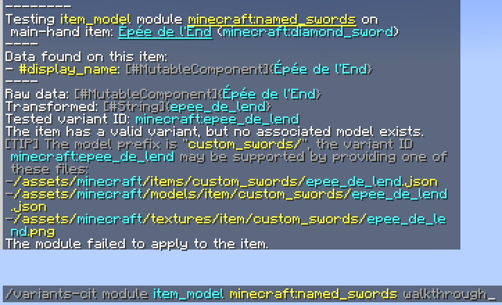

# Getting Started
## The basics
Variants-CIT's format is fundamentally different from Optifine. This tutorial will explain the very basics of VCIT, and walk you through the process of changing a diamond sword based on a name given in an anvil. This assumes you already have some basic understanding of [namespaced identifiers](https://minecraft.wiki/w/Identifier), and how to [create and organize resource packs](https://minecraft.wiki/w/Tutorial:Creating_a_resource_pack).


### 1. Create a CIT module

The module is the object that decides when to change the item's texture, and what texture to use. A single module can manage multiple variants, and does not care about the exact list of variants; it automatically builds a list of variants based on the textures (or other relevant asset types) it finds in its designated folder.

**In most all cases, you will only need a single module per item, regardless of how many textures you have.**

Create a JSON file anywhere in `assets/<namespace>/variants-cit/modules/<path>.json`. The `<namespace>` and `<path>` of the file doesn't affect its functionality. The name of your module should nonetheless be unique, since other packs can overwrite each other's modules.

For starters the file will have this content:
```json
{
	"type": "custom_name",
	"items": "diamond_sword",
	"modelPrefix": "custom_diamond_sword/",
	"assetGen": "item_model/handheld"
}
```

- `type` can be anything from [this list](Module-Types). This will changes how the module will attempt to extract a "variant ID" from an item stack, which is then converted into a texture name.

- `modelPrefix` is the folder where you want to store your textures.
  This is relative to `textures/item/`. The trailing slash '`/`' at the end of the prefix is important !
  The module will treat every texture in this folder as a possible variant for the item.

- `assetGen` tells the module that you will be providing plain textures; the module will automatically generate underlying JSON files that would otherwise be required in a vanilla pack.  
  This value will usually be `item_model/handheld` for tools and weapons, or `item_model/generated` for almost all other items. Items with animations such as bows require more specific values. See the complete list [here](./Asset-Generation#built-in-asset-generator-presets).  

Those are only the basic options 
See [here](Module-Configuration#field-modelprefix) for the complete list of options  on how to configure modules.


### 2. Add textures to the pack

Suppose we want to apply a custom texture to a sword named **"Épée de l'End"**.
We first need to figure out the so-called **"variant ID"** of this item. The variant ID will be combined with the previously chosen model prefix, to give the ID of the model/texture that will be used for this item.

Finding a variant id is a common step for all module types, but the way it is calculated varies from one type to another. In the case of `custom_name`, illegal are characters are simply removed from the item's name.  

More generally, you can find the correct variant ID by using the following command, while holding the sword in your main hand:
```
/variants-cit module item_model <module id> walkthrough
```




In your pack, place your texture at:  
`/assets/minecraft/textures/item/custom_diamond_sword/epee_de_lend.png`  
and that's it! The mod will know to use this texture for this name, you texture pack is now functional.

If you want to support more custom names, you don't need to make any change to the module; just add more textures to the pack, and name them appropriately.

## Using custom models

The above will work if you just want a flat texture for your sword. If you want to use custom [json model](https://minecraft.wiki/w/Model) or [item states](https://minecraft.wiki/w/Items_model_definition), simply provide appropriately named files of those types:  
`/assets/minecraft/items/custom_diamond_sword/epee_de_lend.json`  
`/assets/minecraft/models/item/custom_diamond_sword/epee_de_lend.json`  

Ultimately, all the mod does is override the value of the `item_model` component of the item, meaning everything that can be done with those can be done with Variants-CIT. Having a good understanding of how this component works will help you a lot.


Variant ID                         | `<namespace>:<path>`
---------------------------------- | :-------------------
Equivalent `item_model` component  | `<namespace>:<modelPrefix><path>`
Matching item state                | `/assets/<namespace>/items/<modelPrefix><path>.json`
Matching baked model               | `/assets/<namespace>/models/item/<modelPrefix><path>.json`
Matching texture                   | `/assets/<namespace>/textures/item/<modelPrefix><path>.png`

If you want to use similar files for every variant, you can also try creating a [custom asset generator](./Asset-Generation#custom-asset-generators), for the `assetGen` option, and save you the trouble of manually providing all the files.

## Using custom data as variants
The `custom_name` module type showcased above requires little configuration, but is designed around a specific use case. There are other [purpose-made modules](./Module-Types#purpose-made-modules) for other common use cases, but if you need a variant that is stored into an unusual location, the two modules types that will interest you are [`component_data`](./Module-Types#module-component_data) and [`component_format`](./Module-Types#module-component_format); those let you pick data from anywhere in a chosen component's NBT representation.

Relevant documentation: [Item Properties / Transforms](./Item-Properties)

### Locating the data
Suppose you want to create a module for the effect of suspicious stew:
First, you need to figure out where the variant is stored in the item. Go in-game, put a bowl of supicious stew in your main hand, and use this command:  
```
/data get entity @s SelectedItem.components
```

 This should print something like this into the chat:

![{"minecraft:suspicious_stew_effects": [{duration:7, id:"minecraft:saturation"}]}](./nbt_path_command.jpg)

Here we learn that: (1) The effect id is in a component called `suspicious_stew_effect`. (2) The effect is stored under a key "id", which itself is stored at the first position of an array.

Fill this into the `componentType` and ['`nbtPath`'](./Item-Properties#field-nbtpath) parameters of component_data, and your module will use the effect id as the variant id:
```json
{
	"type": "component_data",
	"items": "suspicious_stew",
	"modelPrefix": "sus_stews/",
	"parameters": {
		"componentType": "suspicious_stew_effects",
		"nbtPath": "[0].id"
	}
}
```

Some specific components or data types may contain character that are illegal for identifiers to hold. See "[Sanitizing the Data](#sanitizing-the-data)" further below.

### Combining multiple pieces of data
The module `component_data` can only work with a single piece of data, `component_format` is its equivalent for working with multiple pieces of data.

Here's a module that constructs a variant id from both a firework's explosion pattern, and its flight duration:
```json
{
	"type": "component_format",
	"items": "firework_rocket",
	"modelPrefix": "item/rocket/",
	"parameters": {
		"format": "${pattern}_${duration}",
		"variables": {
			"pattern":  { "componentType": "fireworks", "nbtPath": ".explosions[0].shape" },
			"duration": { "componentType": "fireworks", "nbtPath": ".flight_duration" }
		}
	}
}
```

The objects inside "variables" are formatted the same way as for the `component_data` module. The variant id is built using the provided `format`, where `${variables}` are substitued with their corresponding value.

### Sanitizing the data
By default, variants are expected to be stored as plain identifiers. If the data you're looking for contains some illegal characters (e.g: `custom_name`), you'll need extra parameters in order to convert it into a valid variant ID. For example, a `component_data` module with these parameters will behave identically to a `custom_name` module :

```json
{
	"componentType": "custom_name",
	"transform": "sanitize"
}
```

If you want to only use only a portion of the text, or require it to match a specific format, you can use regular expressions to transform the data.
For example, this will produce a variant ID formated as `xxxx_steel`:
```json
{
	"componentType": "lore",
	"transform": [
		{ "regex":"(?i)Weapon of (.* steel)", "substitution":"$1" },
		"sanitize",
	]
}
```
Here, the regex is applied _before_ sanitization, but you can change the order of the transforms in order to have the regex evaluate an already sanitized string.

See also: [Transforms](./Item-Properties#transforms)

I recommend you use [regex101.com](https://regex101.com/) to test your regular expressions and substitution strings.

## Read next:
- [FAQ](./FAQ)
- [Troubleshooting](./Troubbleshooting)
